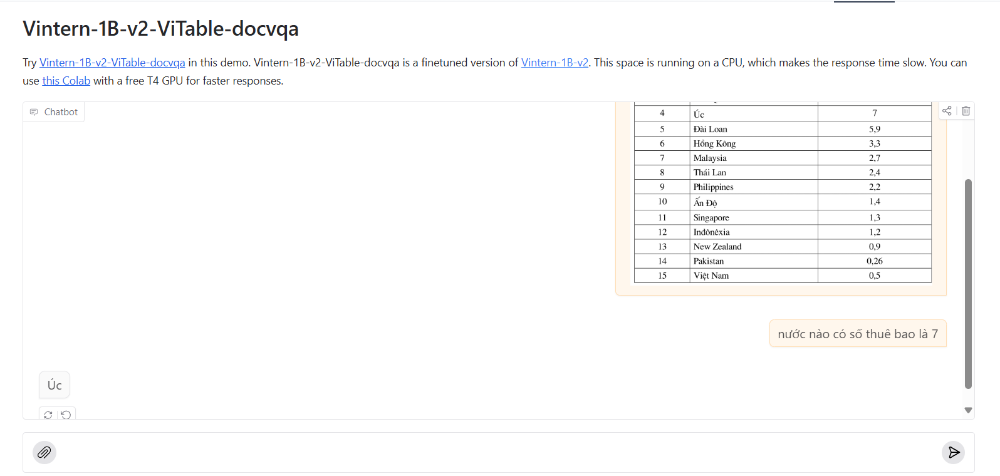
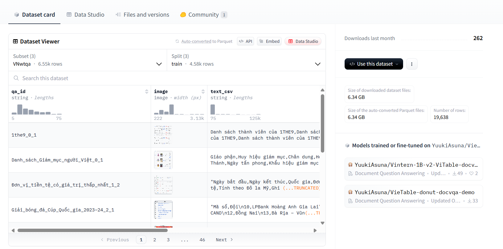

## Introduction
**BKvdu** (BK Visual Table Question Answering) is an advanced document understanding approach that leverages an OCR-free, end-to-end Transformer model. Without relying on external OCR engines or APIs, it achieves state-of-the-art performance across various visual document understanding tasks. In this model, we specifically focus on the Table VQA task with support for the Vietnamese language.
## Pre-trained Models and Web Demos

Our model is built upon Vintern-1B-v2, a powerful OCR-free Vietnamese language model. 

The link to the our model is provided below:
- [`BKvdu`](https://huggingface.co/spaces/YuukiAsuna/Vintern-1B-v2-ViTable-docvqa)
## Dataset
We employed web crawling techniques to extract tabular data from Wikipedia, covering a wide range of topics and categories.

The links to the wikitable-generated datasets are here:

- [`wiki-table`](https://huggingface.co/datasets/YuukiAsuna/VietnameseTableVQA): Vietnamese, 5k.

## Benchmark
We employed three metrics (on a scale of 1) to assess the models’ performance, allowing for a more comprehensive comparison.

**Average Normalized Levenshtein Similarity (ANLS [12])**: Measures the cost of transforming
one string into another, normalized for length differences.

**Semantic Similarity**: We use paraphrase-multilingual-mpnet-base-v2 model to get embedding
vectors of the model’s response and ground truth. These vectors will represent the semantic and feature
of sentences. We then use cosine similarity to evaluates the semantic equivalence of two vectors.

**MLLM-as-Judge (Gemini)**: We use a large language model (Gemini 1.5 Flash) to assess the quality
of responses. The evaluation process involves submitting questions, answers, and response to Gemini
1.5 Flash, which then assigns a quality score between 0 to 10 based on accuracy. After that, we compute
the average score on a scale of 1.
